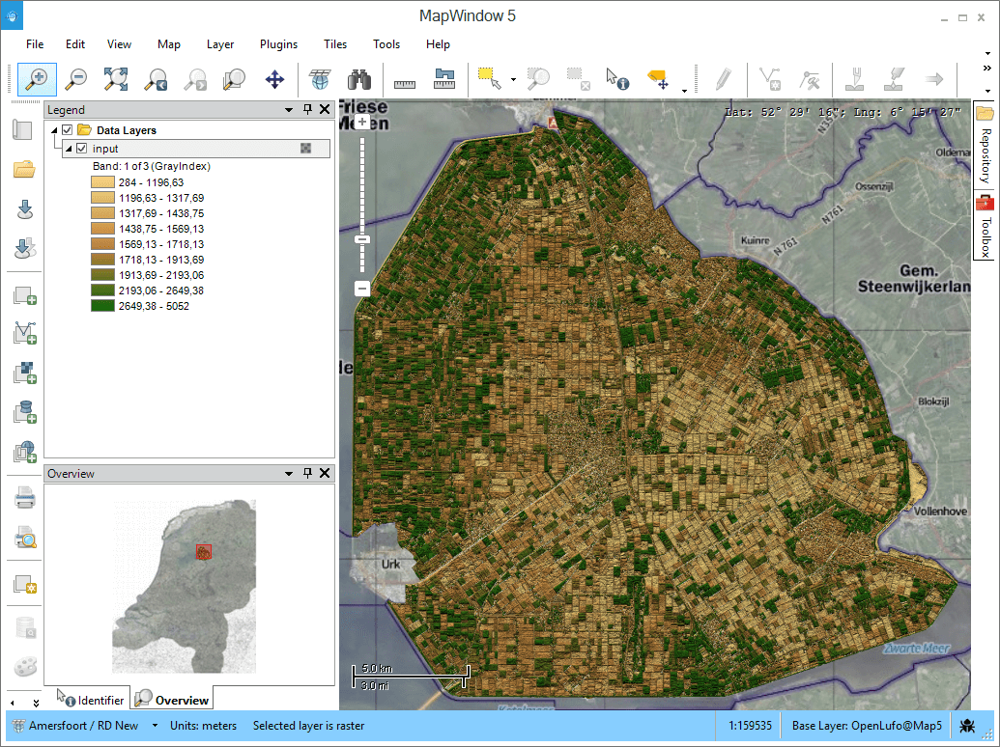

# MapWindow5
MW5 is a desktop GIS which is extendable using the plug-in architecture. 
It is using the MapWinGIS mapping control and is created from scratch in 2015 using new technologies like MEF and Dependency Injection making it small in size, robust and fast.

We're always looking for C#, C++ and OpenCL/OpenGL developers. 
If you have design skills we need you as well ;)

To stay updated follow these links:

* [Official website](http://www.mapwindow.org/)
* [Twitter](https://twitter.com/mapwindow_nl)
* [Google+ community](https://plus.google.com/communities/105819536859650299585)
* [LinkedIn Group](http://www.linkedin.com/groups?gid=122945)
* The MapWindow project newsletter, [click here to subscribe](http://www.mapwindow.org/documentation/mapwindow5/subscribe.php).

## Sponsors

We have several companies that support this project:

* [JetBrains](http://www.jetbrains.com/resharper/index.html?utm_source=MapWindow_GitHub&utm_medium=cpc&utm_campaign=GitHub_click) for giving us a free license of ReSharper: A Developer Productivity Tool for Microsoft Visual Studio;
* [Syncfusion](http://www.syncfusion.com/products/windows-forms?utm_source=MapWindow_GitHub&utm_medium=user_mapwindow&utm_campaign=GitHub_click) for giving us a free license of their Enterprise class toolkit with 110+ unique controls for Windows Forms;
* [TopX Geo-ICT, The Netherlands](http://topx-group.nl/topx-geo-ict?utm_source=MapWindow_GitHub&utm_medium=cpc&utm_campaign=GitHub_click) for providing developers to work on this project and give (paid) support for MapWindow GIS.
